# Team Soju — Hackathon Collaboration Plan

Our working outline for the **Ellipsis Tech Series 2026 Hackathon**, Problem Statement **#2 — Financial Literacy**.
Everything below is derived from the organizers' submission instructions and the official judging rubrics.

---

## 1. Hackathon Roadmap

```mermaid
flowchart TD
    A["<b>Kickoff</b><br/>Team Soju formed<br/>PS #2 — Financial Literacy"] --> B

    subgraph P1["PHASE 1 — Proposal"]
        B["<b>Ideate & Research</b><br/>Target audience, pain points,<br/>competitor scan"] --> C["<b>Draft Proposal</b><br/>Sections 1-5 of the template"]
        C --> D["<b>Internal Review</b><br/>Score ourselves against<br/>the Phase 1 rubric"]
        D --> E["<b>Format & Finalize</b><br/>Arial 11, 1.5 spacing, max 10 pages<br/>ProposalSubmission_Soju"]
    end

    E --> F{{"<b>DEADLINE</b><br/>Sun 30 Aug 2026, 6:00 PM<br/>Proposal submission"}}

    subgraph P2["PHASE 2 — Solution / MVP"]
        F --> G["<b>Architecture & Setup</b><br/>Stack decisions, repo scaffold,<br/>Figma wireframes"]
        G --> H["<b>Build MVP</b><br/>Core features first,<br/>branch + PR per task"]
        H --> I["<b>Test & Harden</b><br/>Kill visible bugs<br/>(Functionality = 20 pts)"]
        I --> J["<b>Demo Video</b><br/>In English + deployment package"]
    end

    J --> K{{"<b>DEADLINE</b><br/>Thu 3 Sep 2026, 9:00 PM<br/>Solution submission"}}

    K --> L["<b>Top 10 Announced</b>"]

    subgraph P3["PHASE 3 — Pitch Day"]
        L --> M["<b>Build Deck</b><br/>Problem → Solution → Impact<br/>+ technical diagrams"]
        M --> N["<b>Rehearse</b><br/>Timed runs, Q&A prep"]
    end

    N --> O{{"<b>PITCH DAY</b><br/>Date TBA<br/>Min. 2 members present"}}

    style F fill:#ffe0e0,stroke:#c00,stroke-width:2px
    style K fill:#ffe0e0,stroke:#c00,stroke-width:2px
    style O fill:#fff2cc,stroke:#d6a300,stroke-width:2px
```

### Deadlines at a glance

| Milestone | When | Deliverable |
|---|---|---|
| Phase 1 — Proposal | **Sun 30 Aug 2026, 6:00 PM** | `ProposalSubmission_Soju` (.doc / .pdf) |
| Phase 2 — Solution | **Thu 3 Sep 2026, 9:00 PM** | MVP + GitHub repo + deployment package + demo video |
| Phase 3 — Pitch Day | **TBA** (Top 10 only) | Live pitch, min. 2 members present |

---

## 2. What We Are Graded On

Design every deliverable backwards from these. Both rubrics total 100.

### Phase 1 — Proposal (100 pts)

| Criterion | Pts | What earns "Excellent" |
|---|---:|---|
| Problem Understanding & Relevance | 25 | Problem statement exceptionally well-defined; solution comprehensively covers the social impact area |
| Solution Impact | 25 | Transformative long-term change; comprehensive scalability & wider-adoption plan |
| Solution Feasibility | 20 | Realistic with our resources; robust, well-defined plan for named challenges |
| Market Fit | 15 | Excellent grasp of target audience; very strong adoption potential |
| Innovation & Creativity | 15 | Numerous standout creative elements; genuinely fresh perspective |

> **Read:** half the proposal score is *problem + impact*, not the tech. Spend research time there.

### Phase 3 — Pitch Day (100 pts)

| Criterion | Pts | What earns "Excellent" |
|---|---:|---|
| Solution Impact & Social Relevance | 20 | Transformative impact, detailed scalability |
| Solution Feasibility | 20 | Highly feasible, strong foresight on challenges |
| Functionality | 20 | Core features fully functional, no significant bugs |
| Market Fit | 15 | Comprehensive fit with target market needs |
| Presentation & Pitch | 15 | Engaging, clear, well-structured, within time |
| Technical Documentation & Presentation | 10 | Highly accurate, detailed technical diagrams |

> **Read:** 20 pts ride on the demo *not breaking*, and 10 pts on diagrams alone. Freeze features early; polish and document.

---

## 3. Proposal Outline & Owners

The template is fixed — submissions not following it are **disqualified**. Max 10 pages excluding cover page, content outline, appendix, references. Arial 11, 1.5 line spacing.

| § | Section | What goes in | Feeds rubric | Owner | Status |
|---|---|---|---|---|---|
| — | Team Details | Name, email, student ID for all members | — | | ☐ |
| 1 | **Solution Overview** | Target audience + rationale; their key pain points; how our solution addresses them | Problem Understanding (25), Market Fit (15) | | ☐ |
| 2 | **Solution Features & Implementation Strategy** | Feature breakdown, criticality ranking; technical + strategic approach; tools, tech, methodology | Feasibility (20), Innovation (15) | | ☐ |
| 3 | **Solution Impact** | Long-term benefit; unique selling points; KPIs | Solution Impact (25) | | ☐ |
| 4 | **Solution Architecture** | Architecture diagram(s) | Feasibility (20) | | ☐ |
| 5 | **Future Development & Scalability** | How we'd grow it with more resources | Solution Impact (25) | | ☐ |
| 6 | Appendix | Research, personas, survey data | — | | ☐ |
| 7 | References | Cite every stat and scheme | Problem Understanding (25) | | ☐ |

**Fill in the Owner column at our next sync.** Every section needs one named owner and one reviewer.

---

## 4. Focus Areas for Financial Literacy (PS #2)

Our target groups, per the problem statement: **lower-income families, gig workers, young adults in Singapore.**
Three angles to pick from — decide early, then go deep on one:

- **Savings habits** — behavioural nudges, goal-based saving, spending visibility for irregular gig income.
- **Government support schemes** — navigating and matching people to schemes they qualify for but don't know about.
- **Long-term financial resilience** — CPF literacy, insurance gaps, debt management, emergency-fund planning.

Anchor claims in real Singapore sources (MOM gig-economy figures, CPF, MoneySense, bank financial-health reports) and cite them in § 7.

---

## 5. Working Agreement

**Team:** Slyf0xXX (owner), Aloysiusjs, anijam99, jenniwiji, dobrovolska17

- **Repo:** https://github.com/Slyf0xXX/ts-hackathon-2026 (private)
- **Design:** FigJam board — https://www.figma.com/board/CgdyCuQ3c6IDiOyxqNpIOE
- **Local notes:** `knowledge_base.md` (gitignored — keep secrets and scratch work here, never in tracked files)

### Git workflow
- Never commit directly to `main`.
- `git checkout main && git pull` before starting anything.
- Branch as `<name>/<short-description>` (e.g. `jenni/savings-nudge-ui`).
- Push, open a PR, get one teammate's review, then merge.
- Keep `.env` and secrets out of git.

### Cadence
- Short daily sync during build week — what's done, what's blocked.
- Every deliverable gets a **reviewer who is not the author**.
- Self-score against the rubric **48 hours before each deadline**, not on the day.

---

## 6. Pre-Submission Checklists

**Phase 1 — before 30 Aug, 6:00 PM**
- [ ] Filename is exactly `ProposalSubmission_Soju`
- [ ] `.doc` or `.pdf` format
- [ ] Arial, size 11, 1.5 line spacing throughout
- [ ] ≤ 10 pages (excluding cover, content outline, appendix, references)
- [ ] Template structure unchanged, all sections filled
- [ ] Team Details table complete for every member
- [ ] Content Outline page numbers updated
- [ ] All sources cited in References
- [ ] Self-scored against the Phase 1 rubric
- [ ] **One** submission made per team

**Phase 2 — before 3 Sep, 9:00 PM**
- [ ] MVP core features work end to end
- [ ] GitHub repo tidy, README explains how to run it
- [ ] Deployment package (if any) included
- [ ] Demo video recorded, in English
- [ ] Every third-party code snippet / framework declared
- [ ] No secrets committed

**Phase 3 — Pitch Day**
- [ ] Deck follows Problem → Solution → Impact
- [ ] Technical diagrams accurate and legible
- [ ] Timed rehearsal done
- [ ] Q&A answers prepared for feasibility and scalability
- [ ] At least 2 members confirmed present
